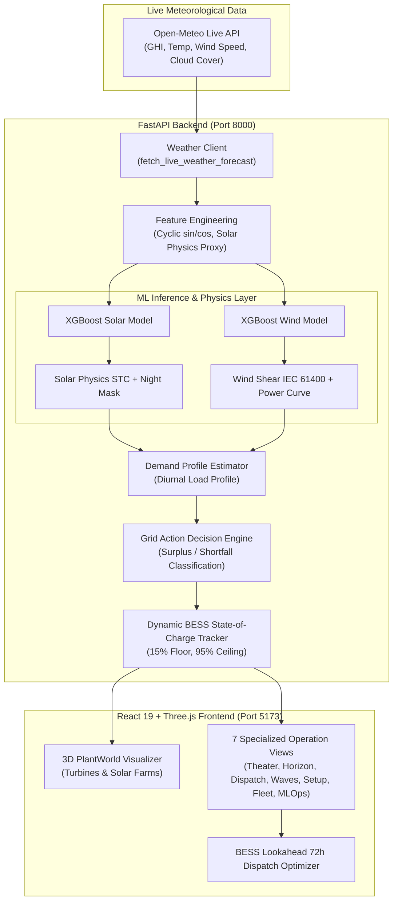

# ⚡ HackOut-2026: AI-Powered Renewable Generation Forecasting & Grid Dispatch Platform

[](https://www.python.org/)
[](https://fastapi.tiangolo.com/)
[](https://react.dev/)
[](https://vitejs.dev/)
[](https://threejs.org/)
[](https://tailwindcss.com/)
[](https://xgboost.readthedocs.io/)
[](https://opensource.org/licenses/ISC)

> **Team Name:** MegaByte  
> **Theme:** Renewable Energy Intelligence  
> **Problem Statement:** AI-Powered Renewable Generation Forecasting Platform  

---

## 📖 Table of Contents

- [Executive Summary](#-executive-summary)
- [System Architecture](#-system-architecture)
- [Key Innovations & Differentiators](#-key-innovations--differentiators)
- [ML Models & Physics-Informed Engine](#-ml-models--physics-informed-engine)
  - [Solar Physics Formulation](#1-solar-physics--equipment-derating)
  - [Wind Physics Formulation](#2-wind-shear--power-curve-modeling)
  - [Model Performance & Validation](#3-model-performance--validation-metrics)
  - [Data Pipeline & Zero-Leakage Guarantee](#4-data-pipeline--zero-leakage-guarantee)
- [BESS Optimization & Grid Decision Engine](#-bess-optimization--grid-decision-engine)
- [Interactive 3D Digital Twin & Frontend](#-interactive-3d-digital-twin--frontend)
- [Complete REST API Reference](#-complete-rest-api-reference)
- [Hardware Equipment Catalog](#-hardware-equipment-catalog)
- [Repository Structure](#-repository-structure)
- [Getting Started & Local Setup](#-getting-started--local-setup)
- [Automated Verification & Auditing Suite](#-automated-verification--auditing-suite)

---

## 🚀 Executive Summary

Renewable generation (solar irradiance and wind velocity) is inherently stochastic, creating severe grid challenges: high curtailment during peak daylight, sudden ramp-rate violations, and supply shortfalls during evening peak demand.

**MegaByte** solves this with a production-grade, end-to-end forecasting and decision platform that pairs:
1. **Physics-Informed XGBoost AI Models**: Predicts normalized generation capacity factor ($\% \text{ of Installed Capacity}$) over 24–72 hour horizons using live zero-key Open-Meteo meteorological streams.
2. **Layer-2 Equipment Derating**: Hardware-level adjustments for real-world equipment (solar efficiency ratios, IEC 61215 temperature deratings, tilt angles, and IEC 61400 wind shear power-law scaling).
3. **Automated Grid Decision & 72-Hour BESS Lookahead Dispatch**: Classifies generation state (`OVER-GENERATION`, `UNDER-GENERATION`, `BALANCED`), simulates battery state-of-charge (SoC) trajectories, flags curtailment risks, and schedules backup peakers.
4. **Interactive 3D Digital Twin**: Built with React 19, Three.js, and TailwindCSS v4, delivering real-time procedural animations of solar arrays, rotating wind turbines, and active telemetry.

---

## 🏗️ System Architecture



---

## 🌟 Key Innovations & Differentiators

| Feature | Conventional Forecasters | MegaByte Platform |
| :--- | :--- | :--- |
| **Prediction Target** | Raw kW / MW (overfits to specific site) | **$\%$ of Installed Capacity** (generalizes to any scale from 10 kW to 2.5 GW) |
| **Physics Grounding** | Pure black-box machine learning | **Physics-Informed Hybrid Blend**: STC equations + IEC standards + ML diurnal nuance |
| **Hardware Realism** | Generic assumption (e.g., flat 20%) | **Equipment Presets**: Exact temperature coefficients ($\gamma$), panel efficiencies, and turbine power curves |
| **Grid Decisioning** | Passive chart viewer | **Automated Dispatch Action Engine**: Battery charge/discharge, curtailment alerts, peaker dispatch |
| **BESS Simulation** | Unconstrained battery math | **Dynamic Lookahead Dispatch**: 15% safety floor, 95% charge ceiling, night shortfall mitigation |
| **Visualization** | Static 2D charts | **Interactive 3D Digital Twin**: Three.js procedural plant rendering with day/night atmospheric lighting |

---

## 🧠 ML Models & Physics-Informed Engine

### 1. Solar Physics & Equipment Derating

The solar output is grounded in Standard Test Conditions (STC: $1000 \text{ W/m}^2$, $25^\circ\text{C}$):

$$\text{Target}_{\text{Solar}} = \frac{\text{Actual Output (kW)}}{\text{Installed Capacity (kW)}} \in [0, 1]$$

#### Multi-Tier Conversion Chain:
1. **Astronomical Night Zeroing**: Clamps output to strictly $0.0 \text{ kW}$ whenever global horizontal irradiance $\text{GHI} < 5.0 \text{ W/m}^2$.
2. **Physics-Anchored Blend**: Combines XGBoost model predictions with an STC physics yield estimate:
   $$\text{pct}_{\text{solar}} = 0.15 \times \text{pct}_{\text{model}} + 0.85 \times \left(\frac{\text{GHI}}{1000}\right)$$
3. **Equipment Efficiency Ratio**:
   $$\eta_{\text{ratio}} = \frac{\eta_{\text{panel}}}{20.0\%}$$
4. **IEC 61215 Temperature Derating**:
   $$F_{\text{temp}}(T) = 1 + \gamma \times (T_{\text{ambient}} - 25^\circ\text{C})$$
   *(where $\gamma$ is negative, e.g., $-0.35\%/^\circ\text{C}$)*
5. **Geometric Tilt Angle Factor**:
   $$F_{\text{tilt}} = \cos\left(|\theta_{\text{actual}} - \theta_{\text{optimal}}| \times \frac{\pi}{180}\right)$$

### 2. Wind Shear & Power Curve Modeling

Wind speed measured at $10\text{m}$ reference height is extrapolated to turbine hub height via **IEC 61400 Wind Shear Power Law**:

$$v_{\text{hub}} = v_{10\text{m}} \times \left(\frac{h_{\text{hub}}}{10}\right)^{0.14}$$

Power generation then traverses the turbine-specific operational stages:
- $v < v_{\text{cut-in}}$: Zero generation ($0\%$).
- $v_{\text{cut-in}} \le v < v_{\text{rated}}$: Cubic power ramp:
  $$P(v) = \left(\frac{v - v_{\text{cut-in}}}{v_{\text{rated}} - v_{\text{cut-in}}}\right)^3$$
- $v_{\text{rated}} \le v < v_{\text{cut-out}}$: Rated maximum capacity ($100\%$).
- $v \ge v_{\text{cut-out}}$: Emergency storm shutdown ($0\%$).

### 3. Model Performance & Validation Metrics

Validated on chronological out-of-sample holdout test data:

| Metric | Solar XGBoost Model | Wind XGBoost Model |
| :--- | :--- | :--- |
| **Model Algorithm** | `XGBRegressor` (300 estimators, max depth 4, lr 0.03) | `XGBRegressor` (300 estimators, max depth 5, lr 0.05) |
| **Mean Absolute Error (MAE)** | **1.23% of Installed Capacity** | **0.39% of Installed Capacity** |
| **Active Hours MAPE** | **8.07%** (filtering zero-generation periods) | **2.83%** (filtering calm periods) |
| **Primary Features** | `solar_physics_proxy` (56%), `irradiance` (34%), `hour_cos` (8%) | `wind_speed` (87%), `hour_sin` (8%), `hour_cos` (5%) |
| **Artifacts** | [solar_model.pkl](file:///d:/Daiict/models/solar_model.pkl), [backtest_chart_solar.png](file:///d:/Daiict/models/backtest_chart_solar.png) | [wind_model.pkl](file:///d:/Daiict/models/wind_model.pkl), [backtest_chart_wind.png](file:///d:/Daiict/models/backtest_chart_wind.png) |

### 4. Data Pipeline & Zero-Leakage Guarantee

- **Split Strategy**: Strict chronological 85% train / 15% test split (`train_data.csv` strictly precedes `test_data.csv`).
- **Timestamp Overlap**: Checked and verified at **0 overlapping timestamps**.
- **Input Features**: Strictly weather-driven and cyclic time variables; no target auto-regression leakage.
  - Solar: `["solar_physics_proxy", "irradiance", "cloud_cover", "temperature", "hour_sin", "hour_cos", "doy_sin", "doy_cos"]`
  - Wind: `["wind_speed", "temperature", "hour_sin", "hour_cos", "doy_sin", "doy_cos"]`

---

## 🔋 BESS Optimization & Grid Decision Engine

The platform features an automated decision engine that evaluates the net balance ($\Delta = P_{\text{generation}} - P_{\text{demand}}$):

### Grid Action Classification:
1. **`OVER-GENERATION` (Surplus)**: Generation exceeds demand by $\ge 5\%$.
   - **Action**: Charge Battery Storage with excess energy.
   - **Curtailment Alert**: When BESS SoC reaches its safety threshold ($\ge 95\%$), triggers:  
     `"Surplus generation exceeds capacity — Curtailment recommended"`.
2. **`UNDER-GENERATION` (Shortfall)**: Generation falls below demand by $\ge 5\%$.
   - **Action**: Discharge Battery Storage to cover the deficit.
   - **Backup Dispatch**: When BESS SoC hits the reserve limit ($\le 15\%$), triggers:  
     `"Activate backup generation to meet demand deficit"`.
3. **`BALANCED`**: Generation and load are within $\pm 5\%$.
   - **Action**: Maintain baseline grid operations.

### Two-Pass Lookahead BESS Optimizer (`src/utils/bessOptimizer.js`):
- **Pass 1 (Lookahead)**: Scans ahead over the 72-hour window to calculate cumulative future night deficit.
- **Pass 2 (Dispatch Simulation)**: Pre-charges BESS during daylight surplus up to what will be consumed during dark hours, preventing over-dispatch and avoiding premature battery degradation.

---

## 💻 Interactive 3D Digital Twin & Frontend

Built with **React 19**, **Three.js**, and **TailwindCSS v4**, the user interface provides 7 operational views:

| View | Code Component | Description |
| :--- | :--- | :--- |
| **Theater (Overview)** | [OverviewView.jsx](file:///d:/Daiict/src/views/OverviewView.jsx) | Three.js procedural 3D solar/wind plant, real-time generation dials, instantaneous load vs. generation comparison. |
| **Horizon (Forecast)** | [ForecastView.jsx](file:///d:/Daiict/src/views/ForecastView.jsx) | 72-hour forecast horizon curves, solar vs. wind kW breakdown, peak output metrics, weather correlation charts. |
| **Dispatch (Actions)** | [ActionsView.jsx](file:///d:/Daiict/src/views/ActionsView.jsx) | Automated action alerts, BESS SoC trajectory graphs, curtailment advisories, backup generator schedules. |
| **Waves (Telemetry)** | [TelemetryView.jsx](file:///d:/Daiict/src/views/TelemetryView.jsx) | Wind turbulence waveform simulations, power quality indicators, grid stability telemetry. |
| **Setup (Config)** | [ConfigView.jsx](file:///d:/Daiict/src/views/ConfigView.jsx) | Live Open-Meteo geocoder, custom plant sizing (MW), tilt angle & hub height sliders, battery kWh & initial SoC. |
| **Fleet (Equipment)** | [EquipmentView.jsx](file:///d:/Daiict/src/views/EquipmentView.jsx) | Hardware catalog comparing manufacturer efficiency ratings, temperature deratings, and turbine cut-in/cut-out speeds. |
| **MLOps Pipeline** | [MLOpsView.jsx](file:///d:/Daiict/src/views/MLOpsView.jsx) | Model performance scores, feature importance weights, zero-leakage validation logs, backtest curves. |

### Built-in Preset Sites:
- ☀️ **Thar Desert Solar Oasis** (Bhadla, Rajasthan — 2,250 MW Solar)
- 💨 **Muppandal Wind Corridor** (Kanyakumari, Tamil Nadu — 1,500 MW Wind)
- ⚡ **Altair Energy Crossroads** (Kutch, Gujarat — 100 MW Hybrid Solar + Wind)
- 📍 **Custom Site**: Search any global city/coordinate with instant geocoding.

---

## 🌐 Complete REST API Reference

The FastAPI backend runs on `http://localhost:8000` with interactive Swagger docs at `http://localhost:8000/docs`.

### 1. Root & Health Status
- **Method / Path:** `GET /`
- **Response:**
  ```json
  {
    "status": "online",
    "service": "AI Renewable Generation Forecasting Engine",
    "team": "MegaByte",
    "hackathon": "HackOut'26"
  }
  ```

### 2. Certified Equipment Presets
- **Method / Path:** `GET /api/equipment/presets`
- **Response:** Returns JSON catalog of solar panels (Waaree, SunPower, LONGi, First Solar, Canadian Solar) and wind turbines (Vestas, GE Vernova, Siemens Gamesa, Suzlon) with engineering parameters.

### 3. Geocoding Search
- **Method / Path:** `GET /api/geocode?q={search_string}`
- **Example:** `GET /api/geocode?q=Ahmedabad`
- **Response:**
  ```json
  {
    "query": "Ahmedabad",
    "results": [
      {
        "name": "Ahmedabad",
        "country": "India",
        "admin1": "Gujarat",
        "latitude": 23.0225,
        "longitude": 72.5714,
        "display": "Ahmedabad, Gujarat, India"
      }
    ]
  }
  ```

### 4. 24–72 Hour Generation Forecast & Decision Engine
- **Method / Path:** `POST /forecast` *(alias `POST /api/forecast`)*
- **Request Payload:**
  ```json
  {
    "location": {
      "latitude": 23.0225,
      "longitude": 72.5714
    },
    "energy_type": "both",
    "installed_capacity_kw": 100000,
    "equipment_model": "SunPower Maxeon 3",
    "equipment_model_wind": "Vestas V162-6.2 MW EnVentus",
    "tilt_angle_deg": 23.0,
    "hub_height_m": 148.0,
    "demand": {
      "known_avg_kw": 40000,
      "category": "commercial"
    },
    "storage": {
      "has_battery": true,
      "battery_capacity_kwh": 50000,
      "battery_current_pct": 50.0,
      "has_backup_generator": true
    },
    "forecast_hours": 72
  }
  ```
- **Response Payload:**
  ```json
  {
    "generated_at": "2026-09-13T09:30:00Z",
    "weather_data_source": "Open-Meteo Live API",
    "energy_type": "both",
    "installed_capacity_kw": 100000.0,
    "total_forecasted_kwh": 1428500.0,
    "peak_generation_kw": 78200.0,
    "equipment": {
      "solar_panel": "SunPower Maxeon 3",
      "wind_turbine": "V162-6.2 MW EnVentus",
      "tilt_angle_deg": 23.0,
      "hub_height_m": 148.0
    },
    "physics_corrections": {
      "solar": { "efficiency_ratio": 1.13, "tilt_factor": 1.0 },
      "wind": { "wind_shear_factor": 1.45 }
    },
    "forecast": [
      {
        "timestamp": "2026-09-13T10:00:00Z",
        "predicted_pct_capacity": 65.4,
        "predicted_kw": 65400.0,
        "solar_kw": 45200.0,
        "wind_kw": 20200.0,
        "demand_kw": 38500.0,
        "bess_soc_pct": 54.2,
        "bess_charge_kw": 26900.0,
        "bess_discharge_kw": 0.0,
        "flag": "OVER-GENERATION",
        "recommended_action": "Charge battery storage with surplus generation",
        "weather": {
          "irradiance": 845.0,
          "cloud_cover": 12.0,
          "temperature": 34.2,
          "wind_speed": 6.8
        }
      }
    ]
  }
  ```

---

## ⚙️ Hardware Equipment Catalog

Pre-configured in [`backend/app/data/equipment_presets.json`](file:///d:/Daiict/backend/app/data/equipment_presets.json):

### Solar Photovoltaic Modules:
| Model | Manufacturer | Rated Power | Efficiency | Temp. Coeff. | Default Tilt |
| :--- | :--- | :--- | :--- | :--- | :--- |
| **Generic Baseline** | Industry Default | 400 W | 20.0% | $-0.35\%/^\circ\text{C}$ | $23^\circ$ |
| **Hi-MO 6 Explorer** | LONGi Solar | 585 W | 22.8% | $-0.29\%/^\circ\text{C}$ | $28^\circ$ |
| **Series 7 TR1** | First Solar | 540 W | 19.7% | $-0.32\%/^\circ\text{C}$ | $30^\circ$ |
| **BiHiKu7** | Canadian Solar | 665 W | 21.4% | $-0.34\%/^\circ\text{C}$ | $26^\circ$ |
| **Mono PERC 540W** | Waaree / Adani | 540 W | 21.1% | $-0.35\%/^\circ\text{C}$ | $23^\circ$ |
| **Maxeon 3 400W** | SunPower | 400 W | 22.6% | $-0.29\%/^\circ\text{C}$ | $20^\circ$ |

### Wind Turbines:
| Model | Manufacturer | Rated Power | Cut-in Speed | Rated Speed | Cut-out Speed | Hub Height |
| :--- | :--- | :--- | :--- | :--- | :--- | :--- |
| **Generic Baseline** | Industry Default | 3,000 kW | 3.0 m/s | 11.5 m/s | 25.0 m/s | 100 m |
| **V162-6.2 MW** | Vestas EnVentus | 6,200 kW | 3.0 m/s | 11.2 m/s | 25.0 m/s | 148 m |
| **Cypress 5.5-158** | GE Vernova | 5,500 kW | 3.0 m/s | 11.0 m/s | 24.5 m/s | 120 m |
| **SG 6.6-170** | Siemens Gamesa | 6,600 kW | 2.5 m/s | 10.8 m/s | 26.0 m/s | 135 m |
| **S120 2.1MW** | Suzlon Energy | 2,100 kW | 3.0 m/s | 11.5 m/s | 20.0 m/s | 120 m |
| **V117 3.45MW** | Vestas | 3,450 kW | 3.0 m/s | 13.0 m/s | 25.0 m/s | 117 m |

---

## 📁 Repository Structure

```
d:/Daiict/
├── backend/
│   ├── main.py                        # FastAPI application, routes, and physics/ML pipelines
│   ├── requirements.txt               # Backend Python dependencies
│   └── app/
│       ├── data/
│       │   └── equipment_presets.json # Certified hardware specs for solar panels & turbines
│       └── services/
│           ├── demand_estimator.py    # Diurnal commercial/residential load profile simulation
│           ├── equipment_lookup.py    # Hardware preset retrieval & default specs
│           ├── feature_engineering.py # Cyclic diurnal/seasonal features & solar physics proxy
│           ├── physics.py             # STC solar corrections, IEC 61400 wind shear, IEC 61215
│           ├── recommend.py           # Generation status flagging & automated action rules
│           └── weather_client.py      # Open-Meteo live API integration with robust fallbacks
├── data/
│   ├── raw_data.csv                   # Historical meteorological & generation observations
│   ├── train_data.csv                 # 85% chronological training dataset
│   └── test_data.csv                  # 15% out-of-sample holdout test dataset
├── models/
│   ├── solar_model.pkl                # Serialized XGBoost solar forecasting model
│   ├── wind_model.pkl                 # Serialized XGBoost wind forecasting model
│   ├── backtest_chart_solar.png       # Solar predicted vs actual validation plot
│   ├── backtest_chart_wind.png        # Wind predicted vs actual validation plot
│   ├── backtest_results_solar.csv     # Numerical backtest results for solar holdout set
│   └── backtest_results_wind.csv      # Numerical backtest results for wind holdout set
├── scripts/
│   ├── backtest.py                    # Backtest runner & matplotlib plot generator
│   ├── data_prep.py                   # Data ingestion, normalization, & chronological split
│   ├── diagnose_cloudy_solar.py       # Cloud cover sensitivity diagnostic & model tuning
│   ├── download_data.py               # Dataset acquisition utility
│   ├── test_api_endpoint.py           # HTTP POST /forecast endpoint sanity test
│   ├── test_live_api.py               # Live Open-Meteo connectivity test
│   ├── train_model.py                 # Model training pipeline (Solar & Wind XGBoost)
│   ├── verify_api_sanity.py           # 12-test automated audit suite for backend engine
│   └── verify_models.py               # Model serialization & feature importance check
├── src/
│   ├── App.jsx                        # Root React layout, site switcher, tab navigation
│   ├── main.jsx                       # React DOM entry point
│   ├── index.css                      # TailwindCSS styles & design tokens
│   ├── components/
│   │   ├── dashboard/                 # Operation views (Overview, Forecast, Actions, Fleet, etc.)
│   │   ├── world/
│   │   │   ├── PlantWorld.jsx         # Three.js 3D procedural plant canvas & animations
│   │   │   └── OrbCanvas.jsx          # Ambient particle canvas
│   │   └── ui/                        # Reusable glassmorphic UI components
│   ├── views/                         # 7 top-level tab views (OverviewView, ForecastView, etc.)
│   ├── utils/
│   │   ├── apiClient.js               # Frontend-to-FastAPI bridge and payload transformer
│   │   └── bessOptimizer.js           # 72-hour BESS two-pass lookahead dispatch optimizer
│   └── data/
│       ├── siteProfiles.js            # Preset energy sites (Bhadla, Muppandal, Kutch)
│       └── mockForecastData.js        # Offline fallback simulation data
├── index.html                         # HTML5 shell with Google Fonts
├── package.json                       # Frontend dependencies & scripts
├── vite.config.js                     # Vite build configuration
└── README.md                          # Project documentation
```

---

## 🚀 Getting Started & Local Setup

### Prerequisites
- **Python 3.10+**
- **Node.js 18+ & npm**

### 1. Backend Setup
```bash
# Navigate to backend directory
cd backend

# Install dependencies
pip install -r requirements.txt

# Or install manually:
pip install fastapi "uvicorn[standard]" xgboost scikit-learn pandas numpy requests joblib pydantic

# Start the FastAPI server (Port 8000)
uvicorn main:app --reload --port 8000
```
> The API will be live at `http://localhost:8000` with interactive docs at `http://localhost:8000/docs`.

### 2. Frontend Setup
```bash
# In project root directory
npm install

# Start Vite development server (Port 5173)
npm run dev

# For production build:
npm run build
```
> Open your browser at `http://localhost:5173` to explore the interactive 3D dashboard.

---

## 🧪 Automated Verification & Auditing Suite

The repository includes a comprehensive testing and validation suite:

### 1. Run the 12-Test Full API Audit Suite
```bash
python scripts/verify_api_sanity.py
```
**Tests Covered:**
- Overnight demand curve continuity (Hour 0 interpolation)
- Co-located hybrid (`energy_type: "both"`) generation summing
- Input schema validation (422 response for invalid energy types)
- Automated BESS charge dispatch during surplus
- Automated BESS discharge dispatch during shortfall
- Curtailment warning when battery reaches full capacity ($\ge 95\%$)
- Backup diesel/peaker dispatch when battery reaches reserve ($\le 15\%$)
- Equipment preset catalog retrieval
- Solar & wind physics deratings calculation
- Dynamic 72-hour BESS State-of-Charge tracking
- Free-text geocoding resolution
- Strict astronomical night zero generation constraint ($< 5 \text{ W/m}^2$)

### 2. Model Integrity & Sanity Verification
```bash
python scripts/verify_models.py
```
- Verifies zero timestamp overlap between train and test splits.
- Validates that training strictly precedes testing chronologically.
- Computes feature importance rankings.
- Compares wind ML predictions against naive physics baseline.

### 3. Model Backtesting & Plot Generation
```bash
python scripts/backtest.py
```
- Evaluates models on 15% out-of-sample data.
- Outputs official MAE and Active MAPE metrics.
- Generates high-resolution backtest plots saved to [`models/`](file:///d:/Daiict/models).

---

## 👥 Team MegaByte

- **Hackathon:** HackOut'26
- **Theme:** Renewable Energy Intelligence
- **Repository:** [https://github.com/jwalkorat/HackOut-2026.git](https://github.com/jwalkorat/HackOut-2026.git)
